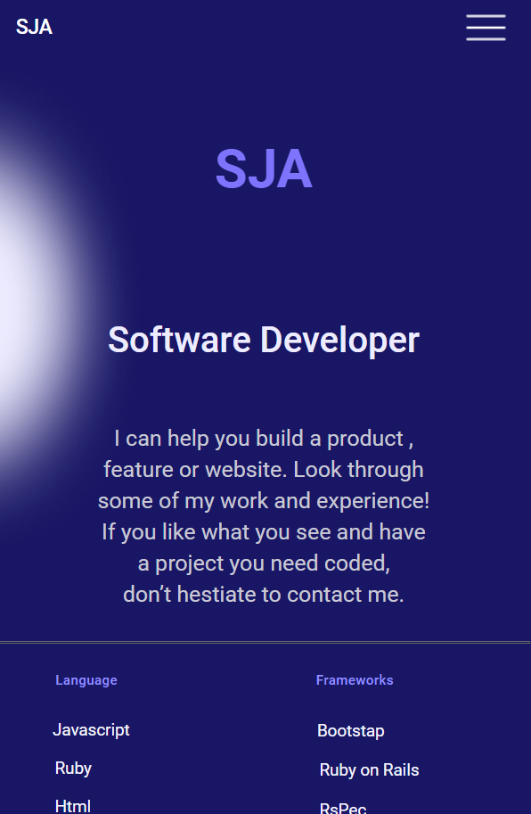
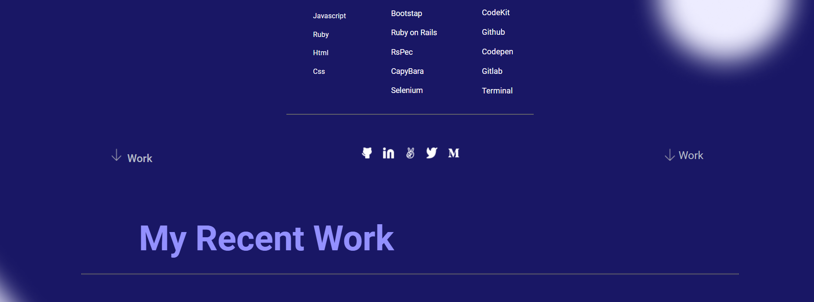
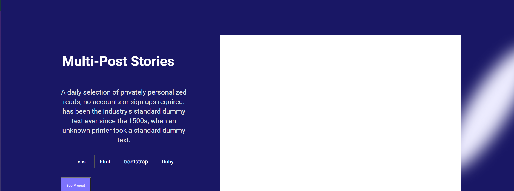

# Project : Portfolio: Mobile Version

## Additional description about the project and its features.

This project is a part of my Microverse curriculum. This is made as the 4th day project at Microverse. This is about my personal portfolio website which is an essential tool for a web developer that showcase my professional skills. The objective is a parse a Figma design with practice HTML/CSS and is made in order to attract job opportunities.

## Getting Started

To get a local copy of the project there are two ways:

- Download the Zip Folder.
- Clone this repository.

## Built With

- HTML
- CSS

## Additional Tools

- Figma

## Live

[Live Link](https://sja-thedude.github.io/Project-Portfolio-setup-and-mobile-version-skeleton/)

## Acknowledgement

- This project is part of day 2 of module 1 block 2 in Microverse curriculum.

## 📝 License

This project is [MIT](./MIT.md) licensed.
